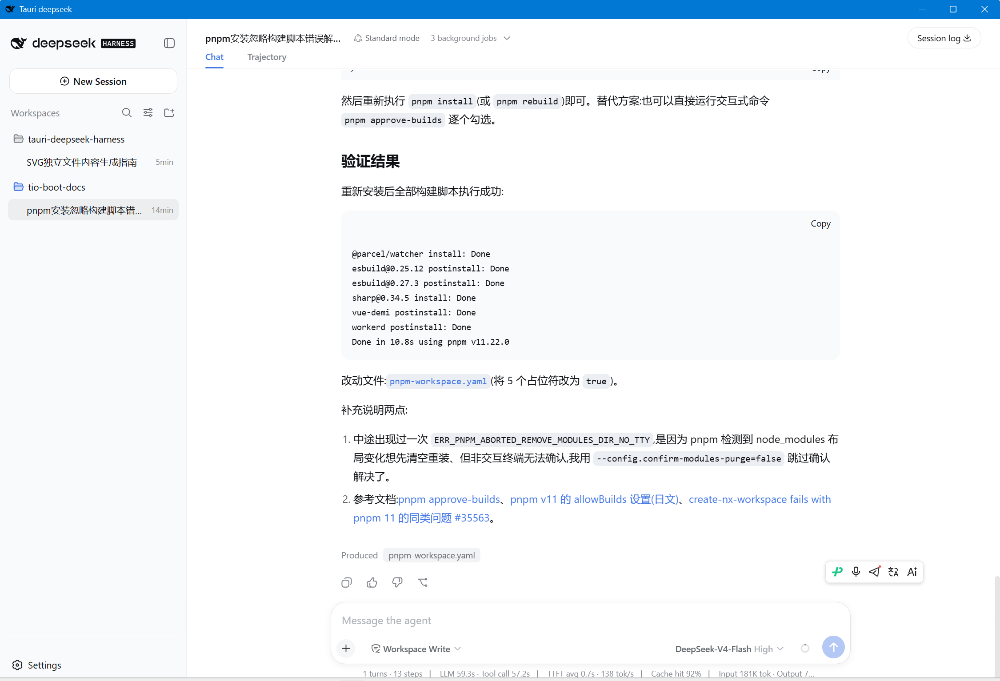

# tauri-deepseek-harness

一个基于 [Tauri](https://tauri.app/) 构建的 [DeepSeek Harness](https://github.com/deepseek-ai/deepseek-harness) 桌面客户端。



## 功能

- **原生体验**：直接从桌面与 DeepSeek Harness 交互，无需打开浏览器。
- **快速且轻量**：使用 Tauri 构建，资源占用少，启动迅速。
- **跨平台**：支持 Windows、macOS 和 Linux。

## 环境要求

- [Node.js](https://nodejs.org/)（v18 或更高版本）及 npm
- DeepSeek API Key（获取方式见下方[第 1 步](#1-获取-api-key)）

## 安装 DeepSeek Harness

DeepSeek Harness（`dsh`）为本桌面应用提供 Web 界面，请先完成安装。

### 1. 获取 API Key

访问 [DeepSeek 开放平台](https://platform.deepseek.com/api_keys)，登录（或注册）后创建一个 API Key。

### 2.（可选）切换 npm 镜像源

如果你在中国大陆，可切换至 npmmirror 镜像源以加快下载速度：

```bash
npm config set registry https://registry.npmmirror.com
```

### 3. 安装 DeepSeek Harness

全局安装命令行工具：

```bash
npm install -g @deepseek-ai/dsh@latest
```

### 4. 启动 Web 界面

```bash
dsh web
```

界面将运行在 `http://127.0.0.1:3080`。使用桌面应用期间请保持该终端窗口运行。

## 安装桌面应用

### 预构建二进制文件

您可以从 [Releases](https://github.com/litongjava/tauri-deepseek-harness/releases) 页面下载适用于您平台的预构建二进制文件。

### 从源代码构建

1. 克隆此仓库：
   ```bash
   git clone https://github.com/litongjava/tauri-deepseek-harness
   ```
2. 进入项目目录：
   ```bash
   cd tauri-deepseek-harness
   ```
3. 安装 Tauri CLI：
   ```bash
   cargo install tauri-cli
   ```
4. 构建应用程序：
   ```bash
   cargo tauri build
   ```

## 使用说明

1. 运行 `dsh web` 启动 DeepSeek Harness（见上文）。
2. 启动桌面应用，它将打开位于 `http://127.0.0.1:3080` 的 Harness 界面。
3. 在界面中输入你的 API Key，即可开始对话。

## 缓存

缓存文件夹：

- **Windows**：`C:\Users\<用户名>\AppData\Local\com.litongjava.tauri.deepseek.harness`

## 贡献

欢迎提交 Pull Request！对于重大更改，请先开启一个 Issue 讨论你希望修改的内容。

## 许可证

[MIT 许可证](LICENSE)
